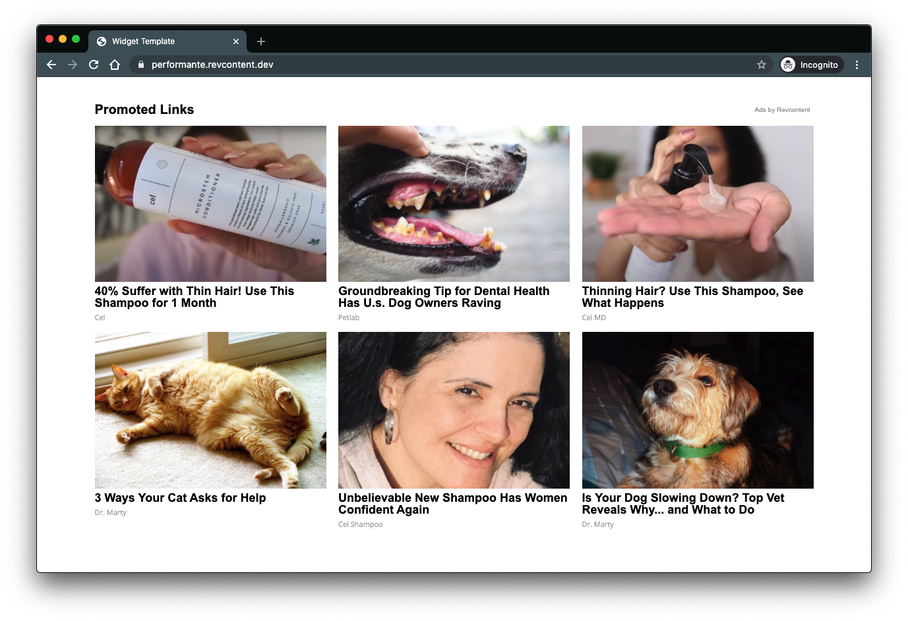

# Revcontent Ad Code - Dev Guide

Revcontents ad code allows publishers to display widgets using modern, lightweight javascript. A typical widget would look like the following:



This guide aims to provide you with technical documentation on how to leverage our ad code, ranging from basic use to advanced implementations. Although we've tried to make our ad code as easy as possible to use, there are certain considerations that must be taken at times to ensure that you are getting the most from your widgets.


### Getting Started

A typical basic ad code for a Revcontent widget looks similar to the following:

```
    <div id="rcjs_load_x9cns"
         data-rc-widget
         data-endpoint="trends.revcontent.com"
         data-widget-id="XXXXX"></div>
    <script src="https://assets.revcontent.com/master/delivery.js" defer></script>
```

This div has four data attributes:

* An id, optional but recommended in case access to the element is required for custom code or logic
* An identifier of data-rc-widget, which flags the element as being a target for rendering a widget onto the page
* An endpoint, which is used to make api calls for content
* A widget id, which holds a numerical value for what widget to display

With the exception of id, these are all required attributes in order to properly render a widget on the page. For more information on how this process works, [see here](widget-lifecycle.md).

#### Multiple Widget Placements

It's possible to have more than one widget on a page. If you require this behavior, you can simply duplicate the div example shown above. However, you will only need to add the script tag to the page one time. The Revcontent javascript file will find any elements on the page that have the `data-rc-widget` attribute on them and render each widget using the respective data set on them. Following this pattern, your markup would look similar to the following:

```
<!DOCTYPE html>
<html lang="en">
  <head>
    <meta charset="UTF-8">
    <title>Example Page</title>
  </head>
  <body>
    <div class="content">
      <div id="rcjs_load_x9cns"
           data-rc-widget
           data-endpoint="trends.revcontent.com"
           data-widget-id="XXXXX"></div>
      <p>Lorem ipsum dolor sit amet, consectetur adipiscing elit. Suspendisse vitae dui porta, varius arcu eget, porttitor purus. Quisque auctor blandit risus sollicitudin accumsan. Aenean lorem diam, molestie at lectus a, posuere sodales leo. Suspendisse placerat libero vel tortor aliquet, non varius diam lacinia. Suspendisse potenti. Pellentesque in viverra justo, vel convallis purus. Cras ante lorem, viverra a congue vel, feugiat eget lorem. Proin vel euismod risus.</p>
      <div id="rcjs_load_zs8af"
           data-rc-widget
           data-endpoint="trends.revcontent.com"
           data-widget-id="XXXXX"></div>
      </div>

    <script src="https://assets.revcontent.com/master/delivery.js" defer></script>
  </body>
</html>
```

Here we have a simple HTML page that has widget placements above and below the paragraph element. At the bottom of the body, we have a script tag that will defer execution until the DOM has finished rendering.

