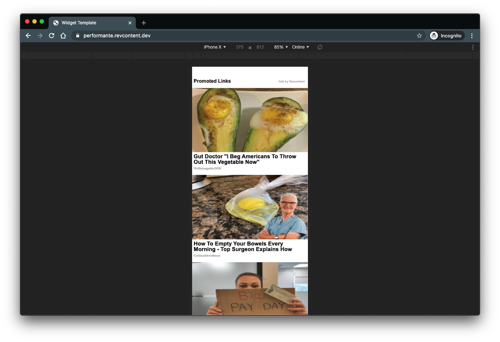

# Using AMP Widgets

Revcontent supports [AMP](https://amp.dev/) tags for displaying our widgets. A typical AMP widget looks like the following:

### Parameters

#### data-id
> Specifies the widget id to be loaded.

#### type
> Specifies the ad network to load. Use revcontent as value.

#### layout
> Specifies the AMP layout to use. Recommended to be set to responsive.

#### width
> Specifies the width of the tag.

#### height
> Specifies the height of the tag.

#### data-revcontent
> Specifies to ad code that tag should load Revcontent widget.

#### data-id
> Specifies the widget id to be loaded.

### Usage

A typical AMP tag will look something like this:

    <amp-ad layout="responsive"
            width="WIDTH_HERE"
            height="HEIGHT_HERE"
            type="revcontent" 
            data-revcontent
            data-id="WIDGET_ID_HERE">
    </amp-ad>

### Other Considerations

The AMP project has a very strict philosophy on patterns that affect the [CLS](https://web.dev/cls/) (Cumulative Layout Shift) scores of mobile pages using AMP. Because of this, it is critical that amp widgets are set to a size that is appropriate for the widget configuration. In the screenshot shown above, the widget shown is configured in a 1x6 pattern (1 column, 6 rows of content). Inspecting this using the Chrome dev tools, we can see that the markup rendered has a size of 375 pixels wide by 1756 pixels tall:

When widgets load via AMP, we make a request to the AMP library to resize the tag so that it is the same size as the widget loaded. However, there is no guarantee that this request will be honored. As such, it is not recommended that you rely solely on the assumption that this request will succeed. In some cases, we have seen publishers deal with denied requests due to the ad code for AMP widgets being implemented without setting an appropriate size on the tag. To read more about some of the factors that are taken into account during this decision, see [here](https://github.com/ampproject/amphtml/blob/master/ads/README.md#ad-resizing).

