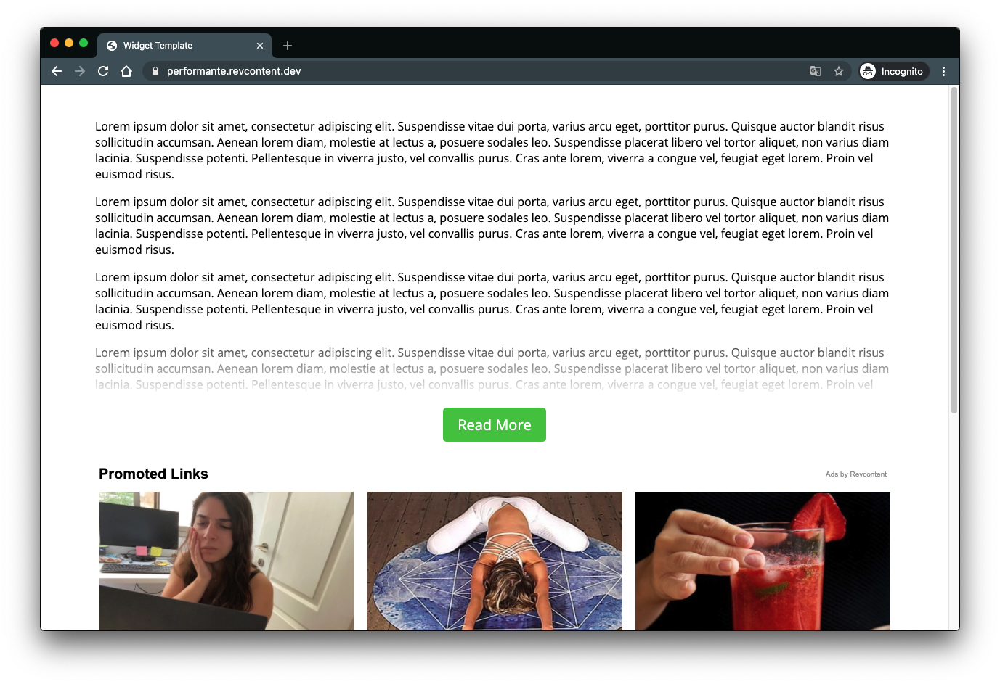

# Using RevMore

Revmore is a feature of the Revcontent widget library that lets you hide a portion of your content to increase engagement with your readers:



### Parameters
Aside from the base attributes, Revmore requires additional configuration data.

#### data-rev-more
> When set, signals that RevMore should be enabled on the widget.

#### data-rev-more-preview-height
> Sets the height of the content container.

#### data-rev-more-button-text
> Specifies what text to show in the button for unlocking more content.

#### data-rev-more-wrapper-id
> Specifies the id of the container holding the content. Must be a valid element id.

#### data-rev-more-devices
> Optional, allows you to specify which kind of devices RevMore should be enabled on (desktop, tablet, mobile).


### Usage
```html
<!-- This element signifies where the page content would be located -->
<div id="rev-more-content"></div>
    
<!-- Widget is placed directly below the content that is to be hidden behind RevMore -->
<div id="rcjs_load_x9cns"
     data-rc-widget
     data-endpoint="trends.revcontent.com"
     data-widget-id="XXXXX"
     data-rev-more
     data-rev-more-preview-height="400"
     data-rev-more-button-text="Read More"
     data-rev-more-wrapper-id="content-wrapper"
     data-rev-more-devices="desktop,tablet,mobile"></div>

<script src="https://assets.revcontent.com/master/delivery.js" defer></script>
```

Optionally, these can be set programmatically as well:

```javascript
var el = document.getElementById('my-widget');
    
if (el) {
  el.setAttribute('data-rev-more', '');
  el.setAttribute('data-rev-more-preview-height', '400');
  el.setAttribute('data-rev-more-button-text', 'Read More');
  el.setAttribute('data-rev-more-wrapper-id', 'content-wrapper');
  el.setAttribute('data-rev-more-devices', 'desktop,tablet,mobile');
}
```
